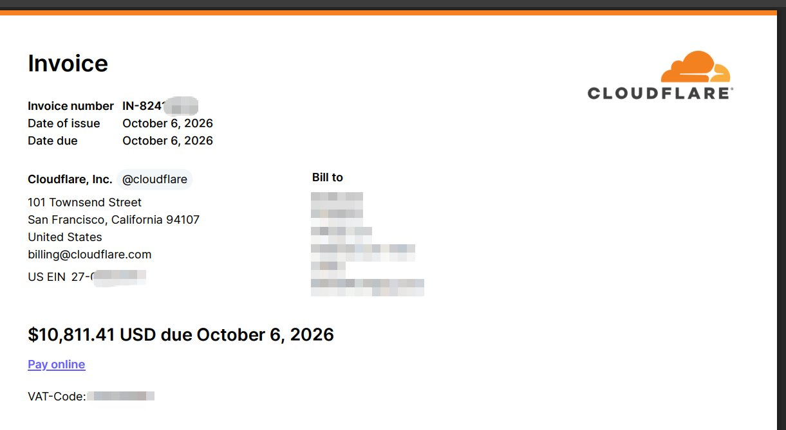

# 云上异常用量早知道，而不是等到天价账单

2026-10-11&emsp;实践&emsp;<a href="./">全部文章</a>

上周有位开发者晒出一张 10,811.41 美元的 Cloudflare 账单：一个没人用的研究项目里，Durable Object 的 alarm 进了死循环，读写了大约六万亿次。代码里的 bug 躺了 23 天，跑起来之后没有任何报错，第一个信号就是发票。Cloudflare 后来同意退款，来龙去脉见我们英文博客里的[复盘](../cloudflare-durable-object-runaway.md)。

发票截图来自 <a href="https://x.com/shmily7">@shmily7</a>，账单信息由作者本人打码。

这样的事并不罕见。同一条讨论下，还有人晒出从一千到一万美元不等的账单，原因都是一个没注意到的循环或轮询。

## 为什么总是月底才知道

三件事凑在了一起：

- **按量计费没有上限。** 按量付费的账号，用多少就收多少钱，不会在某个金额停下来。程序出错的时候，往往不是崩溃，而是一直成功、一直计费。
- **账单本身就有延迟。** 服务商要先把用量汇总、定价，才会出现在账单里。AWS Cost Explorer 的数据可能滞后 24 小时左右，月度发票更是一个月才一张。
- **没人盯着。** 正在用的服务有监控、有报警；真正容易出事的，是那些"先放着"的测试项目和原型。没有流量，就没有人去看它的图表。

前两件是平台的事。第三件，工具可以帮上忙。

## 提前知道，靠的是三件事

CloudBridge 是一个桌面应用，把各家云和模型平台的账单读进你电脑上的一本账。要让异常"早知道"，它做了三件事：

1. **账单每天进来。** AWS 和 Cloudflare 都是按服务、按天读取的。Cloudflare 还可以拆到具体的 Worker、R2 bucket、D1 数据库和 Durable Object 命名空间，免费额度内的用量也会记下来（费用记为零），因为失控往往就是从那里开始的。
2. **关掉窗口也在盯。** 在 macOS 和 Windows 上，关掉窗口后 CloudBridge 留在状态栏，按刷新间隔拉取账单、跑告警规则，有新告警就发系统通知。
3. **规则要对得上场景。** 这一点最容易被忽略，下一节单独说。

## 每种场景用哪条规则

| 场景 | 用哪条规则 | 要注意的 |
| --- | --- | --- |
| 平时有稳定花费，某个服务突然翻倍 | 费用增长异常（默认：连续 2 天超过自身 7 天基线的 2.5 倍） | 第一天不会报，要连续两天；过去七天一分钱没花的服务没有基线，永远不会触发 |
| 沉睡的项目突然跑起来，或新上线的东西失控 | 账号预算，**Based on** 选 **Month-end forecast**（月底预测） | 必须先给账号设月度预算，否则规则什么也不做 |
| 预付费余额被快速消耗，比如 DeepSeek | 余额下限（默认 200，按余额自身的币种；设了预算则以预算为准） | 只看余额，不看花在哪里 |
| 新出现的花费没人认领 | 未打标签花费占比（默认超过 15% 且比上月高） | 依赖 `business_line` 标签 |

第二行是那张一万美元账单真正需要的规则。月底预测从本月第一个有花费的日子开始求日均，所以一个沉睡项目失控的第一天，就会被外推到整个月剩下的日子。举个例子：第一天跑出 300 美元，月底还剩 20 天，预测就超过 6,000 美元；哪怕月度预算只设了 20 美元，读到这一天的第一次刷新就会告警。

而第一行的费用增长异常规则，恰恰抓不到这种情况：它拿一个服务和它自己的过去比，从零开始的花费没有"过去"可比。这是我们已知的盲区，在补上之前，请用预算规则兜底。

## 让它一直在后台盯着

- **刷新间隔缩到 6 小时**：**Settings → Refreshing**。默认是 24 小时。
- **开机启动**：**Settings → Background → Open at login**，重启电脑后也照常盯着。
- **告警通知**：每条新告警发一次系统通知，可以在同一页关掉。

后台每 15 分钟检查一次有没有该刷新的账号，这个检查只读本地账本，不会请求任何云平台；真正的拉取，每个账号每个刷新间隔只有一次，不会因为盯得紧而多花 API 费用。

即便如此，"早知道"也有下限：要等服务商把这一天的用量报出来，再等下一次刷新。所以它能把发现问题的时间从月底提前到一两天之内，做不到秒级。

## 它做不到什么

- **它不能帮你止损。** CloudBridge 只用只读凭据读账单，停不了 Worker，也不该有这个权限。告警来了，还是要你自己去控制台把东西停掉。
- **只能导入账单的平台，没法自动早知道。** 火山引擎、OpenAI 和 Anthropic 目前只能手动导入控制台导出的账单，不导入，账本里就没有新数据。
- **阿里云的账单 API 只给每个产品的月度汇总。** 想看实例级、按模型的明细，需要导入账单明细导出文件，颗粒更细，但同样是手动的。
- **CloudBridge 要在运行。** 电脑关机、应用退出的时候，没有人在盯。Linux 版本没有状态栏图标，窗口关掉就退出了。

## 五分钟设置清单

1. 在 **Accounts** 添加每个云账号，包括那些"先放着"的测试账号。
2. 在 **Rules** 页面给每个账号设一个月度预算：正常一个月的花费，再留些余量。
3. 为每个账号新建一条 **Account budget** 规则，**Based on** 选 **Month-end forecast**。
4. 把刷新间隔改成 6 小时，打开 **Open at login**。
5. 用不上的测试项目，直接删掉。没有部署的东西，不会产生账单。

具体步骤见文档里的[及早发现失控](https://cloudbridge.jetsquirrel.cloud/docs/zh/cloudflare#runaway)和[告警、规则与预算](https://cloudbridge.jetsquirrel.cloud/docs/zh/alerts)。

天价账单最难受的地方，不是金额本身，而是它来的时候，钱早就花出去了。把发现的时间往前挪，才是能做到的事。
